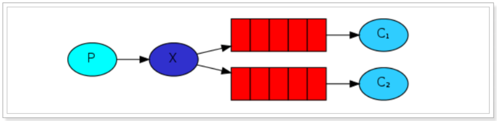

# 学习目标

- 学习目标能够说出什么是消息队列
- 能够说出RabbitMQ的5种模式特征

- 能够安装RabbitMQ
- 能够使用SpringBoot整合RabbitMQ

- 能够编写RabbitMQ的入门程序


# 1. 消息队列概述

MQ全称为Message Queue，消息队列是应用程序和应用程序之间的通信方法。

RabbitMQ是一个Erlang开发的AMQP（Advanced Message Queuing Protocol ）的开源实现。

## 1.1 为什么使用MQ

在项目中，可将一些无需即时返回且耗时的操作提取出来，进行异步处理，而这种异步处理的方式大大的节省了服务器的请求响应时间，从而提高了系统的吞吐量。

开发中消息队列通常有如下应用场景：

**(1) 异步操作: **

​	任务异步处理将不需要同步处理的并且耗时长的操作由消息队列通知消息接收方进行异步处理。提高了应用程序的响应时间。

**(2) 解耦: **

​	应用程序解耦合MQ相当于一个中介，生产方通过MQ与消费方交互，它将应用程序进行解耦合

**(3) 削峰: **

​	在访问量剧增的情况下，应用仍然需要继续发挥作用，但是这样的突发流量并不常见；如果为以能处理这类峰值访问为标准来投入资源随时待命无疑是巨大的浪费。使用MQ能够使关键组件顶住突发的访问压力，而不会因为突发的超负荷的请求而完全崩溃。

**(4) 可恢复性: **

​	系统的一部分组件失效时，不会影响到整个系统。MQ降低了进程间的耦合度，所以即使一个处理消息的进程挂掉，加入队列中的消息仍然可以在系统恢复后被处理。


## 1.2. 消息队列产品

市场上常见的消息队列有如下：

- ActiveMQ：基于JMS实现, 比较均衡, 不是最快的, 也不是最稳定的.
- ZeroMQ：基于C语言开发, 目前最好的队列系统.
- RabbitMQ：基于AMQP协议，erlang语言开发，稳定性好, 数据基本上不会丢失
- RocketMQ：基于JMS，阿里巴巴产品, 目前已经捐献给apahce, 还在孵化器中孵化.
- Kafka：类似MQ的产品；分布式消息系统，高吞吐量, 目前最快的消息服务器, 不保证数据完整性.

##  1.3. AMQP 和 JMS

MQ是消息通信的模型；实现MQ的大致有两种主流方式：AMQP、JMS。

### 1.3.1. AMQP

AMQP是一种协议，更准确的说是一种binary wire-level protocol（链接协议）。这是其和JMS的本质差别，AMQP不从API层进行限定，而是直接定义网络交换的数据格式。

### 1.3.2. JMS

JMS即Java消息服务（JavaMessage Service）应用程序接口，是一个Java平台中关于面向消息中间件（MOM）的API，用于在两个应用程序之间，或分布式系统中发送消息，进行异步通信。

### 1.3.3. AMQP 与 JMS 区别

JMS是定义了统一的接口，来对消息操作进行统一；AMQP是通过规定协议来统一数据交互的格式JMS限定了必须使用Java语言；AMQP只是协议，不规定实现方式，因此是跨语言的。JMS规定了两种消息模式；而AMQP的消息模式更加丰富.

|        | JMS      |     AMQP      |
| ------ | -------- | :-----------: |
| 定义   | Java api | Wire-protocol |
| 跨语言 | 否       |      是       |
| 跨平台 | 否       |      是       |


## 1.4. RabbitMQ

RabbitMQ是由erlang语言开发，基于AMQP（Advanced Message Queue 高级消息队列协议）协议实现的消息队列，它是一种应用程序之间的通信方法，消息队列在分布式系统开发中应用非常广泛。

RabbitMQ官方地址：http://www.rabbitmq.com/

RabbitMQ提供了6种模式：Hello Word简单模式，work工作模式，Publish/Subscribe发布与订阅模式，Routing路由模式，Topics主题模式(通配符模式)，RPC远程调用模式（远程调用，不太算MQ；不作介绍）

官网对应模式介绍：https://www.rabbitmq.com/getstarted.html


## 1.5 相关定义：

- Broker： 简单来说就是消息队列服务器实体
- Exchange： 消息交换机，它指定消息按什么规则，路由到哪个队列
- Queue： 消息队列载体，每个消息都会被投入到一个或多个队列
- Binding： 绑定，它的作用就是把exchange和queue按照路由规则绑定起来
- Routing Key： 路由关键字，exchange根据这个关键字进行消息投递
- VHost： 虚拟主机，一个broker里可以开设多个vhost，用作不同用户的权限分离。
- Producer： 消息生产者，就是投递消息的程序
- Consumer： 消息消费者，就是接受消息的程序
- Channel： 消息通道，在客户端的每个连接里，可建立多个channel，每个channel代表一个会话任务

**由Exchange、Queue、RoutingKey三个才能决定一个从Exchange到Queue的唯一的线路。**


# 2. 安装及配置RabbitMQ

## 2.1. docker中安装RabbitMq

- 下载镜像 

```shell
docker pull rabbitmq:management
```

- 创建容器 

```shell
docker run -di --name=changgou_rabbitmq -p 5671:5617 -p 5672:5672 -p4369:4369 -p 15671:15671 -p 15672:15672 -p 25672:25672 rabbitmq:management
```

```
解释如下：
	15672 (if management plugin is enabled.管理界面 )

	15671 management监听端口

	5672, 5671 (AMQP 0-9-1 without and with TLS 消息队列协议是一个消息协议)

	4369 (epmd) epmd 代表 Erlang 端口映射守护进程

	25672 (Erlang distribution)
```

- 访问后台 

浏览器中输入地址

```shell
http://192.168.200.128:15672/
```

- 设置容器开机自动启动

```shell
docker update --restart=always 容器ID
```

## 2.2. 用户以及Virtual Hosts配置

### 2.2.1. 用户角色

RabbitMQ在安装好后，可以访问http://localhost:15672；其自带了guest/guest的用户名和密码；如果需要创建自定义用户；那么也可以登录管理界面后，如下操作：


**角色说明：**

1、超级管理员(administrator)可登陆管理控制台，可查看所有的信息，并且可以对用户，策略(policy)进行操作。2、监控者(monitoring)可登陆管理控制台，同时可以查看rabbitmq节点的相关信息(进程数，内存使用情况，磁盘使用情况等)

3、策略制定者(policymaker)可登陆管理控制台, 同时可以对policy进行管理。但无法查看节点的相关信息(上图红框标识的部分)。

4、普通管理者(management)仅可登陆管理控制台，无法看到节点信息，也无法对策略进行管理。

5、其他无法登陆管理控制台，通常就是普通的生产者和消费者。

### 2.2.2. Virtual Hosts配置

像mysql拥有数据库的概念并且可以指定用户对库和表等操作的权限。RabbitMQ也有类似的权限管理；在RabbitMQ中可以虚拟消息服务器Virtual Host，每个Virtual Hosts相当于一个相对独立的RabbitMQ服务器，每个VirtualHost之间是相互隔离的。exchange、queue、message不能互通。相当于mysql的db。Virtual Name一般以/开头。

1. 创建Virtual Hosts

   

2. 设置Virtual Hosts权限

   

   

   


# 3. Spring Boot整合RabbitMQ

## 3.1. 简介

在Spring项目中，可以使用Spring-Rabbit去操作RabbitMQ https://github.com/spring-projects/spring-amqp尤其是在spring boot项目中只需要引入对应的amqp启动器依赖即可，方便的使用RabbitTemplate发送消息，使用注解接收消息。

一般在开发过程中：

**生产者工程：**

1. application.yml文件配置RabbitMQ相关信息；
2.  在生产者工程中编写配置类，用于创建交换机和队列，并进行绑定
3.  注入RabbitTemplate对象，通过RabbitTemplate对象发送消息到交换机

**消费者工程：**

1. application.yml文件配置RabbitMQ相关信息
2.  创建消息处理类，用于接收队列中的消息并进行处理

## 3.2. 搭建生产者工程

### 3.2.1. 创建工程

创建生产者工程springboot-rabbitmq-producer


### 3.2.2. 添加依赖

修改pom.xml文件内容为如下：

```xml
<?xml version="1.0" encoding="UTF-8"?>
<project xmlns="http://maven.apache.org/POM/4.0.0"
         xmlns:xsi="http://www.w3.org/2001/XMLSchema-instance"
         xsi:schemaLocation="http://maven.apache.org/POM/4.0.0 http://maven.apache.org/xsd/maven-4.0.0.xsd">
    <modelVersion>4.0.0</modelVersion>

    <groupId>com.itheima</groupId>
    <artifactId>rabbitmq_producer</artifactId>
    <version>1.0-SNAPSHOT</version>

    <parent>
        <groupId>org.springframework.boot</groupId>
        <artifactId>spring-boot-starter-parent</artifactId>
        <version>2.1.4.RELEASE</version>
    </parent>

    <dependencies>
        <dependency>
            <groupId>org.springframework.boot</groupId>
            <artifactId>spring-boot-starter-amqp</artifactId>
        </dependency>
        <dependency>
            <groupId>org.springframework.boot</groupId>
            <artifactId>spring-boot-starter-test</artifactId>
        </dependency>
    </dependencies>
</project>
```

### 3.2.3. 启动类

```java
package com.itheima.rabbitmq;

import org.springframework.boot.SpringApplication;
import org.springframework.boot.autoconfigure.SpringBootApplication;

@SpringBootApplication
public class ProducerApplication {
    public static void main(String[]args) {
        SpringApplication.run(ProducerApplication.class, args);
    }
}
```

### 3.2.4. 配置RabbitMQ

1）配置文件

创建application.yml，内容如下：

```yaml
spring:
  rabbitmq:
    host: 192.168.200.128
    port: 5672
    virtual-host: /itcast
    username: heima
    password: 123456
```


## 3.3. 搭建消费者工程

### 3.3.1. 创建工程

创建消费者工程springboot-rabbitmq-consumer


### 3.3.2. 添加依赖

修改pom.xml文件内容为如下：

```xml
<?xml version="1.0" encoding="UTF-8"?>
<project xmlns="http://maven.apache.org/POM/4.0.0"
         xmlns:xsi="http://www.w3.org/2001/XMLSchema-instance"
         xsi:schemaLocation="http://maven.apache.org/POM/4.0.0 http://maven.apache.org/xsd/maven-4.0.0.xsd">
    <modelVersion>4.0.0</modelVersion>

    <groupId>com.itheima</groupId>
    <artifactId>rabbitmq_consumer</artifactId>
    <version>1.0-SNAPSHOT</version>

    <parent>
        <groupId>org.springframework.boot</groupId>
        <artifactId>spring-boot-starter-parent</artifactId>
        <version>2.1.4.RELEASE</version>
    </parent>
    <dependencies>
        <dependency>
            <groupId>org.springframework.boot</groupId>
            <artifactId>spring-boot-starter-amqp</artifactId>
        </dependency>
    </dependencies>
</project>
```

### 3.3.3. 启动类

```java
package com.itheima.rabbitmq;

import org.springframework.boot.SpringApplication;
import org.springframework.boot.autoconfigure.SpringBootApplication;

@SpringBootApplication
public class ConsumerApplication {
    public static void main(String[] args) {
        SpringApplication.run(ConsumerApplication.class, args);
    }
}

```

### 3.3.4. 配置RabbitMQ

创建application.yml，内容如:

```yaml
spring:
  rabbitmq:
    host: 192.168.200.128
    port: 5672
    virtual-host: /itcast
    username: heima
    password: 123456
```


# 4. RabbitMQ工作模式

## 4.1Hello World简单模式

### 4.1.1 什么是简单模式


在上图的模型中，有以下概念：

**P：生产者: **  也就是要发送消息的程序

**C：消费者：**消息的接受者，会一直等待消息到来。

**queue：**消息队列，图中红色部分。类似一个邮箱，可以缓存消息；生产者向其中投递消息，消费者从其中取出消息。

### 4.1.2 RabbitMQ管理界面操作

- 创建simple_queue队列用于演示Hello World简单模式


- 点击 `simple_queue` 可以进入到这个queue的管理界面


- 点击 `Get Message` 按钮可以获取查看队列中的消息


### 4.1.3 生产者代码

- rabbitmq_producer项目测试代码如下:


```java
package com.itheima.rabbitmq.simple;

import com.itheima.rabbitmq.ProducerApplication;
import org.junit.Test;
import org.junit.runner.RunWith;
import org.springframework.amqp.rabbit.core.RabbitTemplate;
import org.springframework.beans.factory.annotation.Autowired;
import org.springframework.boot.test.context.SpringBootTest;
import org.springframework.test.context.junit4.SpringRunner;

@SpringBootTest(classes = ProducerApplication.class)
@RunWith(SpringRunner.class)
public class TestSimple {

    @Autowired
    private RabbitTemplate rabbitTemplate;

    @Test
    public void testSimpleSend() {
        rabbitTemplate.convertAndSend("simple_queue", "你好, 小兔子!");
    }
}
```


### 4.1.4 消费者代码

- rabbitmq_consumer项目创建监听器:


```java
package com.itheima.rabbitmq.simple;

import org.springframework.amqp.rabbit.annotation.RabbitHandler;
import org.springframework.amqp.rabbit.annotation.RabbitListener;
import org.springframework.stereotype.Component;

@Component
@RabbitListener(queues = "simple_queue")
public class SimpleListener {

    @RabbitHandler
    public void testListener(String message) {
        System.out.println("======接收到的消息为:======" + message);
    }
}
```

然后启动ConsumerApplication.java, 就可以接收到RabbitMQ服务器发送来的消息


## 4.2 Work queues工作队列模式

### 4.2.1 什么是工作队列模式


Work Queues与入门程序的简单模式相比，多了一个或一些消费端，多个消费端共同消费同一个队列中的消息。**应用场景：对于任务过重或任务较多情况使用工作队列可以提高任务处理的速度。**

**在一个队列中如果有多个消费者，那么消费者之间对于同一个消息的关系是竞争的关系。**

### 4.2.2 RabbitMQ管理界面操作

- 创建 `work_queue` 队列用于演示work工作队列模式


### 4.2.3 生产者代码

rabbitmq_producer项目测试代码如下:

```java
package com.itheima.rabbitmq.work;

import com.itheima.rabbitmq.ProducerApplication;
import org.junit.Test;
import org.junit.runner.RunWith;
import org.springframework.amqp.rabbit.core.RabbitTemplate;
import org.springframework.beans.factory.annotation.Autowired;
import org.springframework.boot.test.context.SpringBootTest;
import org.springframework.test.context.junit4.SpringRunner;

@SpringBootTest(classes = ProducerApplication.class)
@RunWith(SpringRunner.class)
public class TestWork {

    @Autowired
    private RabbitTemplate rabbitTemplate;

    @Test
    public void testWorkSend() {
        for (int i = 0; i < 1000; i++){
            rabbitTemplate.convertAndSend("work_queue", "你好, 小兔子" + i);
        }

    }
}
```


### 4.2.4 消费者代码

- rabbitmq_consumer项目创建监听器1:


```java
package com.itheima.rabbitmq.work;

import org.springframework.amqp.rabbit.annotation.RabbitHandler;
import org.springframework.amqp.rabbit.annotation.RabbitListener;
import org.springframework.stereotype.Component;

@Component
@RabbitListener(queues = "work_queue")
public class WorkListener1 {

    @RabbitHandler
    public void testListener(String message) {
        System.out.println("======WorkListener1接收到的消息为:======" + message);
    }
}
```

- rabbitmq_consumer项目创建监听器2:


```java
package com.itheima.rabbitmq.work;

import org.springframework.amqp.rabbit.annotation.RabbitHandler;
import org.springframework.amqp.rabbit.annotation.RabbitListener;
import org.springframework.stereotype.Component;

@Component
@RabbitListener(queues = "work_queue")
public class WorkListener2 {

    @RabbitHandler
    public void testListener(String message) {
        System.out.println("======WorkListener2接收到的消息为:======" + message);
    }
}
```

## 4.3 三种模式概览




前面2个案例中，只有3个角色：

- P：生产者，也就是要发送消息的程序

- C：消费者：消息的接受者，会一直等待消息到来。

- queue：消息队列，图中红色部分

  

而在订阅模型中，多了一个exchange角色，而且过程略有变化：

- P：生产者，也就是要发送消息的程序，但是不再发送到队列中，而是发给X（交换机）
- C：消费者，消息的接受者，会一直等待消息到来。
- Queue：消息队列，接收消息、缓存消息。
- Exchange：交换机，图中的X。一方面，接收生产者发送的消息。另一方面，知道如何处理消息，例如递交给某个特别队列、递交给所有队列、或是将消息丢弃。到底如何操作，取决于Exchange的类型。


Exchange有常见以下3种类型：

- ​		**Fanout：广播**  将消息交给所有绑定到交换机的队列, 不处理路由键。只需要简单的将队列绑定到交换机上。**fanout 类型交换机转发消息是最快的。**

- ​		**Direct：定向**  把消息交给符合指定routing key 的队列. 处理路由键。需要将一个队列绑定到交换机上，要求该消息与一个特定的路由键完全匹配。如果一个队列绑定到该交换机上要求路由键 “dog”，则只有被标记为 “dog” 的消息才被转发，不会转发 dog.puppy，也不会转发 dog.guard，只会转发dog。

  **其中，路由模式使用的是 direct 类型的交换机。**

- ​		**Topic：主题(通配符)**  把消息交给符合routing pattern（路由模式）的队列. 将路由键和某模式进行匹配。此时队列需要绑定要一个模式上。符号 “#” 匹配一个或多个词，符号“*”匹配不多不少一个词。因此“audit.#” 能够匹配到“audit.irs.corporate”，但是“audit.*” 只会匹配到 “audit.irs”。

  **其中，主题模式(通配符模式)使用的是 topic 类型的交换机。**

  

**Exchange（交换机）只负责转发消息，不具备存储消息的能力，因此如果没有任何队列与Exchange绑定，或者没有符合路由规则的队列，那么消息会丢失**


## 4.4 Publish/Subscribe发布与订阅模式

### 4.4.1 什么是发布订阅模式


发布订阅模式： 

​	1、每个消费者监听自己的队列。 

​	2、生产者将消息发给broker，由交换机将消息转发到绑定此交换机的每个队列，每个绑定交换机的队列都将接收到消息

### 4.4.2 RabbitMQ管理界面操作

- 创建两个队列 `test1_queue` 和 `test2_queue`


- 创建Exchange交换器 `fanout_exchange`


- 将创建的fanout_exchange交换器和 `test1_queue` ,  `test2_queue` 队列绑定


### 4.4.3 生产者代码

- rabbitmq_producer项目测试代码如下:

```java
package com.itheima.rabbitmq.pubandsub;

import com.itheima.rabbitmq.ProducerApplication;
import org.junit.Test;
import org.junit.runner.RunWith;
import org.springframework.amqp.rabbit.core.RabbitTemplate;
import org.springframework.beans.factory.annotation.Autowired;
import org.springframework.boot.test.context.SpringBootTest;
import org.springframework.test.context.junit4.SpringRunner;

@SpringBootTest(classes = ProducerApplication.class)
@RunWith(SpringRunner.class)
public class TestPubAndSub {
    @Autowired
    private RabbitTemplate rabbitTemplate;

    @Test
    public void testPubAndSubSend() {
        for(int i = 1; i < 100; i++) {
            rabbitTemplate.convertAndSend("fanout_exchange","" , "你好, 小兔子" + i);
        }
    }
}
```


### 4.4.4 消费者代码

- rabbitmq_consumer项目创建监听器:

```java
package com.itheima.rabbitmq.listener;

import org.springframework.amqp.rabbit.annotation.RabbitHandler;
import org.springframework.amqp.rabbit.annotation.RabbitListener;
import org.springframework.stereotype.Component;

@Component
@RabbitListener(queues = "test1_queue")
public class TestListener1 {

    @RabbitHandler
    public void testListener(String message) {
        System.out.println("======test1_queue接收到的消息为:======" + message);
    }
}
```

- rabbitmq_consumer项目创建监听器:

```java
package com.itheima.rabbitmq.listener;

import org.springframework.amqp.rabbit.annotation.RabbitHandler;
import org.springframework.amqp.rabbit.annotation.RabbitListener;
import org.springframework.stereotype.Component;

@Component
@RabbitListener(queues = "test2_queue")
public class TestListener2 {

    @RabbitHandler
    public void testListener(String message) {
        System.out.println("======test2_queue接收到的消息为:======" + message);
    }
}
```


## 4.5 Routing路由模式

### 4.5.1 什么是路由模式

路由模式特点：队列与交换机的绑定，不能是任意绑定了，而是要指定一个RoutingKey（路由key）消息的发送方在向 Exchange发送消息时，也必须指定消息的RoutingKey。Exchange不再把消息交给每一个绑定的队列，而是根据消息的Routing Key进行判断，只有队列的Routingkey与消息的Routing key完全一致，才会接收到消息.


图解：

P：生产者，向Exchange发送消息，发送消息时，会指定一个routing key。

X：Exchange（交换机），接收生产者的消息，然后把消息递交给与routing key完全匹配的队列

C1：消费者，其所在队列指定了需要routing key 为 error 的消息

C2：消费者，其所在队列指定了需要routing key 为 info、error、warning 的消息

### 4.5.2 RabbitMQ管理界面操作

- 创建两个队列分别叫做 `direct_queue_insert` 和 `direct_queue_update` 用户演示


- 创建交换器 `direct_exchange` , 类型为 `direct` , 用于演示路由模式


- 设置绑定: 将创建的交换器 `direct_exchange` 和 `direct_queue_insert` , `direct_queue_update` 绑定在一起, 路由键Routing Key分别为 `insertKey` 和 `updateKey`


### 4.5.3 生产者代码

- rabbitmq_producer项目测试代码如下:

```java
package com.itheima.rabbitmq.routing;

import com.itheima.rabbitmq.ProducerApplication;
import org.junit.Test;
import org.junit.runner.RunWith;
import org.springframework.amqp.rabbit.core.RabbitTemplate;
import org.springframework.beans.factory.annotation.Autowired;
import org.springframework.boot.test.context.SpringBootTest;
import org.springframework.test.context.junit4.SpringRunner;

@SpringBootTest(classes = ProducerApplication.class)
@RunWith(SpringRunner.class)
public class TestRouting {

    @Autowired
    private RabbitTemplate rabbitTemplate;

    @Test
    public void testPubAndSubSend() {
        for(int i = 1; i < 100; i++) {
            if (i % 2 == 0) {
                rabbitTemplate.convertAndSend("direct_exchange","insertKey" , "你好, 小兔子" + i);
            } else {
                rabbitTemplate.convertAndSend("direct_exchange","updateKey" , "你不太好, 小兔子" + i);
            }
        }
    }
}

```


### 4.5.4 消费者代码

- rabbitmq_consumer项目创建监听器:

```java
package com.itheima.rabbitmq.routing;

import org.springframework.amqp.rabbit.annotation.RabbitHandler;
import org.springframework.amqp.rabbit.annotation.RabbitListener;
import org.springframework.stereotype.Component;

@Component
@RabbitListener(queues = "direct_queue_insert")
public class TestInsertListener {

    @RabbitHandler
    public void testListener(String message) {
        System.out.println("======test1_queue接收到的消息为:======" + message);
    }
}
```

- rabbitmq_consumer项目创建监听器:

```java
package com.itheima.rabbitmq.routing;

import org.springframework.amqp.rabbit.annotation.RabbitHandler;
import org.springframework.amqp.rabbit.annotation.RabbitListener;
import org.springframework.stereotype.Component;

@Component
@RabbitListener(queues = "direct_queue_update")
public class TestUpdateListener {

    @RabbitHandler
    public void testListener(String message) {
        System.out.println("======test2_queue接收到的消息为:======" + message);
    }
}
```


## 4.6 Topics通配符模式(主题模式)

### 4.6.1 什么是通配符(主题)模式

`Topic`类型与`Direct`相比，都是可以根据RoutingKey把消息路由到不同的队列。只不过Topic类型Exchange可以让队列在绑定Routing key的时候使用通配符！

`Routingkey`: 一般都是有一个或多个单词组成，多个单词之间以”.”分割，例如：`item.insert`

通配符规则：

#：匹配一个或多个词

*：匹配不多不少恰好1个词

举例：

**item.#：** 能够匹配`item.insert.abc`或者`item.insert`

**item.*：**只能匹配`item.insert`


图解：

- 红色Queue：绑定的是`usa.#`，因此凡是以usa.开头的routing key都会被匹配到

- 黄色Queue：绑定的是`#.news`，因此凡是以.news结尾的routing key都会被匹配


### 4.6.2 RabbitMQ管理界面操作

- 创建队列 `topic_queue1` 和 `topic_queue1`


- 创建交换器 `topic_exchange` , type类型为 `topic`


- 设置绑定: 

  ​	`topic_queue1`绑定的Routing Key路由键为`item.*`

  ​	`topic_queue2`绑定的Routing Key路由键为`item.#`


### 4.6.3 生产者代码

- rabbitmq_producer项目测试代码如下:

```java
package com.itheima.rabbitmq.topic;

import com.itheima.rabbitmq.ProducerApplication;
import org.junit.Test;
import org.junit.runner.RunWith;
import org.springframework.amqp.rabbit.core.RabbitTemplate;
import org.springframework.beans.factory.annotation.Autowired;
import org.springframework.boot.test.context.SpringBootTest;
import org.springframework.test.context.junit4.SpringRunner;

@SpringBootTest(classes = ProducerApplication.class)
@RunWith(SpringRunner.class)
public class TestTopic {

    @Autowired
    private RabbitTemplate rabbitTemplate;

    @Test
    public void testTopicSend() {
        rabbitTemplate.convertAndSend("topic_exchange","item.select" , "你好, 小兔子");
        rabbitTemplate.convertAndSend("topic_exchange","item.select.abc" , "你不太好, 小兔子");
    }

}
```


### 4.6.4 消费者代码

- rabbitmq_consumer项目创建监听器:

```java
package com.itheima.rabbitmq.topic;

import org.springframework.amqp.rabbit.annotation.RabbitHandler;
import org.springframework.amqp.rabbit.annotation.RabbitListener;
import org.springframework.stereotype.Component;

@Component
@RabbitListener(queues = "topic_queue1")
public class TestTopicListener1 {

    @RabbitHandler
    public void testListener(String message) {
        System.out.println("======topic_queue1接收到的消息为:======" + message);
    }
}
```

- rabbitmq_consumer项目创建监听器:

```java
package com.itheima.rabbitmq.topic;

import org.springframework.amqp.rabbit.annotation.RabbitHandler;
import org.springframework.amqp.rabbit.annotation.RabbitListener;
import org.springframework.stereotype.Component;

@Component
@RabbitListener(queues = "topic_queue2")
public class TestTopicListener2 {

    @RabbitHandler
    public void testListener(String message) {
        System.out.println("======topic_queue2接收到的消息为:======" + message);
    }
}
```


## 4.7 模式总结RabbitMQ

工作模式：

**1、简单模式 HelloWorld : ** 一个生产者、一个消费者，不需要设置交换机（使用默认的交换机）

**2、工作队列模式 Work Queue:**  一个生产者、多个消费者（竞争关系），不需要设置交换机（使用默认的交换机）

**3、发布订阅模式 Publish/subscribe: **需要设置类型为fanout的交换机，并且交换机和队列进行绑定，当发送消息到交换机后，交换机会将消息发送到绑定的队列

**4、路由模式 Routing: ** 需要设置类型为direct的交换机，交换机和队列进行绑定，并且指定routing key，当发送消息到交换机后，交换机会根据routing key将消息发送到对应的队列

**5、通配符模式 Topic: ** 需要设置类型为topic的交换机，交换机和队列进行绑定，并且指定通配符方式的routing key，当发送消息到交换机后，交换机会根据routing key将消息发送到对应的队列


