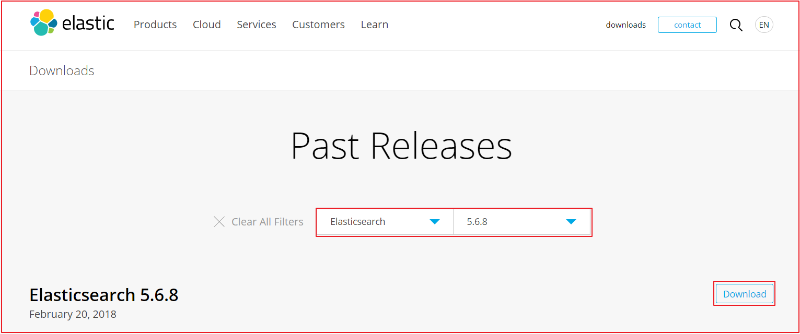
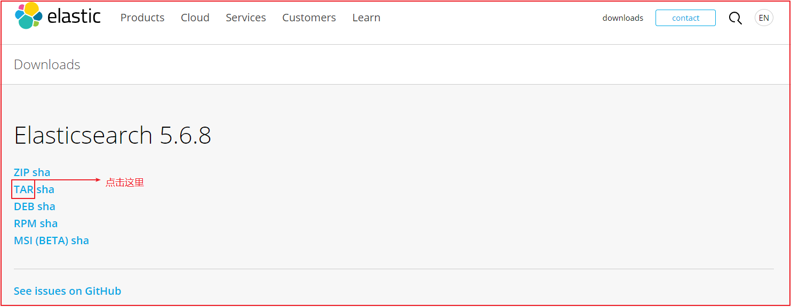
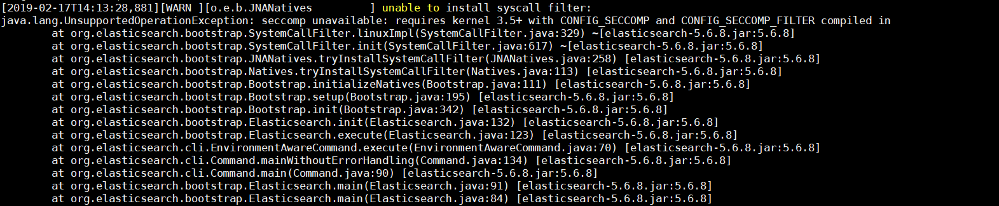
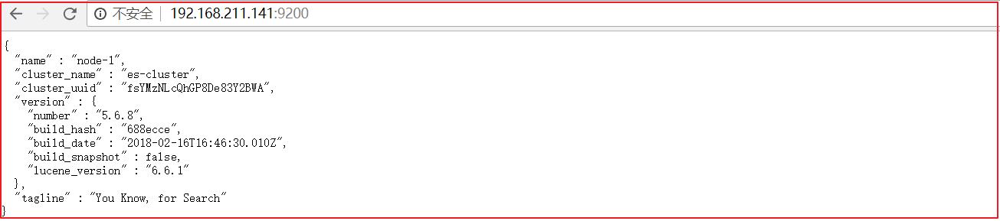

## 1. Elasticsearch 安装 (Linux)

我们之前已经使用过elasticsearch了，这里不再对它进行介绍了，直接下载安装。

### 1.1 elasticsearch下载

下载elasticsearch：https://www.elastic.co/downloads/past-releases





下载后如下安装包


### 1.2 elasticsearch安装

在安装elasticsearch之前，我们先准备一台centos7，ip：192.168.200.128，账号 root  密码 itcast，请先确保centos6.5虚拟机上已经安装好了jdk，并将上面下载的安装包上传到centos6.5上面。

安装过程如下：

解压elasticsearch压缩文件

```properties
[root@localhost es]# tar -xf elasticsearch-5.6.8.tar.gz
[root@localhost es]# ls
elasticsearch-5.6.8  elasticsearch-5.6.8.tar.gz
```


创建es用户，并授权（为了安全，elasticsearch不允许用root账号启动，所以需要创建非root账号）

```properties
[root@localhost es]# groupadd es
[root@localhost es]# useradd es -g es
[root@localhost es]# passwd es
Changing password for user es.
New password:
BAD PASSWORD: it is too simplistic/systematic
BAD PASSWORD: is too simple
Retype new password:
passwd: all authentication tokens updated successfully.
```


目录授权

```properties
[root@localhost es]# chown -R es:es elasticsearch-5.6.8
```


切换es用户，并修改默认配置

```properties
[root@localhost elasticsearch-5.6.8]# su es
[es@localhost elasticsearch-5.6.8]$ cd config/
[es@localhost config]$ vi elasticsearch.yml
```


修改数据如下图：


参数说明：

```
cluster.name 集群的名字
node.name 节点名字
network.host 网络地址
http.port http 端口
path.data 数据的存储路径
path.log 日志的存储路径
```


启动elasticsearch

```properties
[es@localhost config]$ cd ../bin
[es@localhost bin]$ ./elasticsearch
```


当前操作系统为centos6.5，会出现如下警告，这里只需要升级centos内核即可解决，这里我们可以直接忽略。




### 1.3 安装错误信息解决

错误信息：


解决方法：

修改limits.conf文件

```properties
[es@localhost /]$ su root
Password:itcast
[root@localhost /]# vi /etc/security/limits.conf
```

在该文件的倒数第2行增加如下代码

```properties
* soft nofile 65536
* hard nofile 131072
* soft nproc 2048
* hard nproc 4096
```


修改/etc/security/limits.d/90-nproc.conf，将1024改成2048

```properties
[root@localhost bin]# vi /etc/security/limits.d/90-nproc.conf


* soft nproc 1024
改成
* soft nproc 2048
```


修改/etc/sysctl.conf，追加如下代码

```properties
vi /etc/sysctl.conf

在最后面加上如下代码：
vm.max_map_count=655360
```


执行sysctl -p  会出现如下参数配置信息

```properties
net.ipv4.ip_forward = 0
net.ipv4.conf.default.rp_filter = 1
net.ipv4.conf.default.accept_source_route = 0
kernel.sysrq = 0
kernel.core_uses_pid = 1
net.ipv4.tcp_syncookies = 1
net.bridge.bridge-nf-call-ip6tables = 0
net.bridge.bridge-nf-call-iptables = 0
net.bridge.bridge-nf-call-arptables = 0
kernel.msgmnb = 65536
kernel.msgmax = 65536
kernel.shmmax = 68719476736
kernel.shmall = 4294967296
vm.max_map_count = 655360
```


修改完成后切换到es用户,并修改elasticsearch.yml

```properties
[root@localhost /]# su es
[es@localhost /]$ cd /usr/local/server/es/elasticsearch-5.6.8/config
[es@localhost config]$ vi elasticsearch.yml
```

修改下面一行代码，去掉注释，并改成false

```properties
#bootstrap.memory_lock: true
```

改后

```properties
bootstrap.memory_lock: false
```

增加一行代码

```properties
bootstrap.system_call_filter: false
```


保存并退出，然后再启动elasticsearch

```properties
[es@localhost config]$ cd ../bin
[es@localhost bin]$ ./elasticsearch
```


输入http://192.168.211.141:9200/



**注意**：如果此时还是没法启动，但不报错的话，记得增加虚拟机内存到2G以上。


## 2. 集成IK分词器

IK分词器下载地址https://github.com/medcl/elasticsearch-analysis-ik/releases

将ik分词器上传到服务器上，先上传到第1个es的plugins目录下，并解压,并将解压后的ik文件，拷贝到每个es的plugins目录下。

```properties
[root@localhost plugins]# unzip elasticsearch-analysis-ik-5.6.8.zip -d ./ik
[root@localhost plugins]# cp -r ik /usr/local/server/es/elasticsearch-5.6.8/plugins
[root@localhost plugins]# cp -r ik /usr/local/server/es/elasticsearch-5.6.8/plugins
```


## 3. 安装elasticsearch-head-master

1. 安装依赖包

```shell
yum install epel-release 
```

2. 安装node, 并且npm包也会一起安装

```shell
yum install nodejs 
```

3. 测试安装是否成功

```shell
node -v
npm
```

4. 将grunt安装为全局命令，Grunt是基于Node.js的项目构建工具

```shell
npm install -g grunt-cli
```

5. 修改elasticsearch配置文件：elasticsearch.yml，增加以下两句命令

   此步为允许elasticsearch跨域访问

```yml
http.cors.enabled: true
http.cors.allow-origin: "*"
```

6. 进入elasticsearch-head-master目录启动head，在命令提示符下输入命令：

```shell
grunt server
```

7. 打开浏览器，输入http://192.168.200.128:9100

## 4. Kibana下载

Kibana 的版本需要和 Elasticsearch 的版本一致。 

下载地址：https://www.elastic.co/downloads/past-releases


下载后文件如下图：


### 4.2 Kibana安装

解压上面下载的安装包，并修改kibana.yml配置文件

```properties
[root@localhost kibana]# tar -xf kibana-5.6.8-linux-x86_64.tar.gz
[root@localhost kibana]# ls
kibana-5.6.8-linux-x86_64  kibana-5.6.8-linux-x86_64.tar.gz
[root@localhost kibana]# mv kibana-5.6.8-linux-x86_64 kibana-5.6.8
[root@localhost kibana]# ls
kibana-5.6.8  kibana-5.6.8-linux-x86_64.tar.gz
[root@localhost kibana]# cd kibana-5.6.8
[root@localhost kibana-5.6.8]# cd config/
[root@localhost config]# vi kibana.yml
```

修改配置文件kibana.yml,修改如下：

```properties
server.host: "192.168.200.128"
elasticsearch.url: "http://192.168.200.128:9200"
```

启动kibana

```properties
[root@localhost config]# cd ../bin
[root@localhost bin]# ./kibana
```

启动后命令行会提示访问地址


访问http://192.168.211.141:5601   如下图：


### 4.3 Kibana使用

#### 4.3.1 配置索引

要使用Kibana，您必须至少配置一个索引。索引用于标识Elasticsearch索引以运行搜索和分析。它们还用于配置字段。 


我们修改索引名称的匹配方式即可，下面2个选项不用勾选。点击create，会展示出当前配置的索引的域信息，如下图：


域的每个标题选项分别代表如下意思：


#### 4.3.2 数据搜索

Discover为数据搜索部分，可以对日志信息进行搜索操作。


可以使用Discover实现数据搜索过滤和搜索条件显示以及关键词搜索，如下图：


#### 4.3.3 DSL语句使用

##### 4.3.3.1 Query DSL结构化查询介绍

Query DSL是一个Java开源框架用于构建类型安全的SQL查询语句。采用API代替传统的拼接字符串来构造查询语句。目前Querydsl支持的平台包括JPA,JDO，SQL，Java Collections，RDF，Lucene，Hibernate Search。elasticsearch提供了一整套基于JSON的查询DSL语言来定义查询。
Query DSL当作是一系列的抽象的查询表达式树(AST)特定查询能够包含其它的查询，(如 bool ), 有些查询能够包含过滤器(如 constant_score), 还有的可以同时包含查询和过滤器 (如 filtered). 都能够从ES支持查询集合里面选择任意一个查询或者是从过滤器集合里面挑选出任意一个过滤器, 这样的话，我们就可以构造出任意复杂（maybe 非常有趣）的查询了。


##### 4.3.3.2 term过滤

term主要用于精确匹配，如字符串、数值、日期等（不适合情况：1.列中除英文字符外有其它值 2.字符串值中有冒号或中文 3.系统自带属性如_version） 

如下案例：

```json
GET _search
{
  "query": {
    "term": {
      "city": "深圳"
    }
  }
}
```

效果如下：


##### 4.3.3.3 terms 过滤

terms 跟 term 有点类似，但 terms 允许指定多个匹配条件。 如果某个字段指定了多个值，那么文档需要一起去做匹配 。

案例如下：

```json
GET _search
{
  "query": {
    "terms": {
      "city": [
        "深圳",
        "天津"
      ]
    }
  }
}
```


果如下：


##### 4.3.3.4 range 过滤

range过滤允许我们按照指定范围查找一批数据 .。例如我们查询年龄范围

案例如下：

```json
GET _search
{
  "query": {
    "range": {
      "age": {
        "gte": 30,
        "lte": 40
      }
    }
  }
}
```

上图效果如下：


##### 4.3.3.5 exists过滤

exists 过滤可以用于查找文档中是否包含指定字段或没有某个字段，类似于SQL语句中的IS_NULL条件 

案例如下：

```json
GET _search
{
  "query": {
    "exists":   {
        "field": "name"
    }
  }
}
```

效果如下：


##### 4.3.3.6 bool 过滤

bool 过滤可以用来合并多个过滤条件查询结果的布尔逻辑，它包含一下操作符：

- must : 多个查询条件的完全匹配,相当于 and。
- must_not : 多个查询条件的相反匹配，相当于 not。
- should : 至少有一个查询条件匹配, 相当于 or。

这些参数可以分别继承一个过滤条件或者一个过滤条件的数组：

案例如下：

```json
GET _search
{
  "query": {
    "bool": {
      "must": {
        "term":{
          "city":"深圳"
          }
        },
        "must": 
          {
            "term": {
             "name": "张三" 
            }
          }
      }
  }
}
```

效果如下：


##### 4.3.3.7 match_all 查询

可以查询到所有文档，是没有查询条件下的默认语句。 

案例如下：

```json
GET _search
{
  "query": {
    "match_all": {}
  }
}
```

效果如下：


##### 4.3.3.8 match 查询

match查询是一个标准查询，不管你需要全文本查询还是精确查询基本上都要用到它。

如果你使用 match 查询一个全文本字段，它会在真正查询之前用分析器先分析match一下查询字符：

案例如下：

```json
GET _search
{
  "query": {
    "match": {
      "description": "中国挖掘机"
    }
  }
}
```

效果如下：


##### 4.3.3.9 prefix 查询

以什么字符开头的，可以更简单地用 prefix ,例如查询所有以张开始的用户描述

案例如下：

```json
GET _search
{
  "query": {
    "prefix": {
      "description": "张"
    }
  }
}
```

效果如下：


##### 4.3.3.10 multi_match 查询

multi_match查询允许你做match查询的基础上同时搜索多个字段，在多个字段中同时查一个 

案例如下：

```json
GET _search
{
  "query": {
    "multi_match": {
      "query": "张",
      "fields": [
        "description",
        "name"
        ]
    }
  }
}
```

效果如下：


